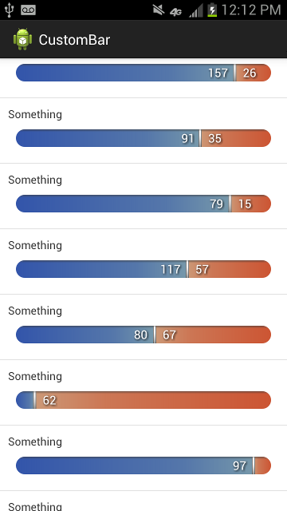
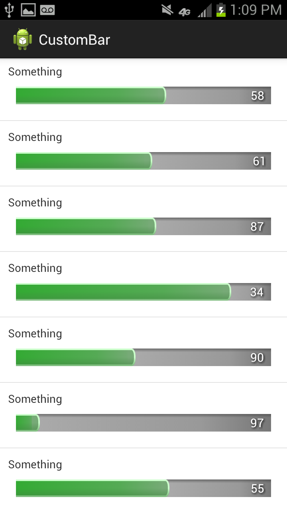

CustomBar
===========

This is intended to be a "static" `ProgressBar`, customizable with three `Drawable`s (left, right, center indicator). Could be easily extended to behave like a real `ProgressBar` or like a touch input.




Setup
-----
In Eclipse, import the library as an Android library project.

Usage
-----
You can `setLeftCount()` and `setRightCount()` on your view element and it will update the drawings.

XML Usage
-----
```xml
<com.custombar.custombar.CustomBar
        android:id="@+id/custom_bar"
        android:layout_width="fill_parent"
        android:layout_height="22dp"
        android:layout_margin="10dp"
        app:leftCount="20"
        app:rightCount="10"
        app:centerDrawable="@drawable/center"
        app:leftDrawable="@drawable/left"
        app:rightDrawable="@drawable/right"
        app:textShadowDX="1dp"
        app:textShadowDY="1dp"
        app:textShadowRadius="2dp"
        app:textSize="15sp"
        app:centerOffset="0dp"
        app:textOffset="10dp" />
```
* `leftCount` - count for left
* `rightCount` - count for right
* `leftDrawable` - a reference to the Drawable to be used as left bg
* `centerDrawable` - a reference to the Drawable to be used as center indicator
* `rightDrawable` - a reference to the Drawable to be used as right bg
* `centerOffset` - margin around the center indicator
* `textLeft` - whether to show the left text or not (default: `true`)
* `rightLeft` - whether to show the right text or not (default: `true`)
* `textAnchorCenter` - whether to anchor the text to the center indicator or or to anchor instead to the left and right sides, respectively (deafult: `true`)
* `textOffset` - margin around text
* `textSize` - text size
* `textColor` - text color
* `textShadow` - whether to show a text shadow or not (default: `true`)
* `textShadowColor` - color for the text shadow
* `textShadowRadius` - radius for the text shadow
* `textShadowDX` - horizontal offset for the text shadow
* `textShadowDY` - vertical offset for the text shadow
* `verticalPadding` - use this to shrink the left and right bgs vertically (e.g.: if you want the center indicator to be higher than the bar itself).

The center indicator is drawn using its `intrinsicSize`

